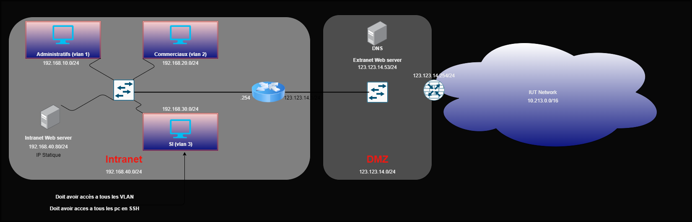

# 
<b>⚠️ <u>ATTENTION LIRE AVANT DE COMMENCER</u> ⚠️</b>

 

### Pour vous accompagnez durant la mise en place de notre installation veuillez suivre les étapes ci-dessous :
### Vous pourrez retrouver sur le github une image png de notre montage réseau qui se nomme : **Schema_SAE21.png**

Là voila en miniature :

 

## 1️⃣ | Branchement Mikrotik :

 

* Prendre le routeur qui est au nom de Ndeye Codou Touré
* Le brancher à l'ordinateur et à internet
* Faire un dhclient sur l'ordinateur

 

⚠️ Si vous rencontrez des difficultés avec le routeur sur le montage par exemple une machine administrative n'arrive pas à un ping internet, joindre le web externe, si vous n'arrivez pas à trouver d'où provient le problème de la config enlever le du montage, le routeur sur gns3 dispose de NAT permettant de joindre internet avec le réseau de salle 213 et peut joindre le web externe + DNS sans le mikrotik.

 

## 2️⃣ | Web externe + DNS :

 

* Lancer sur un second ordinateur qui servira de serveur web et dns le script bash nommé : **apache2conf.sh**

 

Vous vous attendiez peut-être à récupérer des fichiers confs pour les deux services mais grâce à un technicien de notre entreprise tout ceci devient autonome.

 

⚠️ En cas de problème avec un des services ou même les deux vous pourrez retrouver les fichiers confs originals dans le dossier **DNSetApache.zip**

 

## 3️⃣ | GNS3

 

* Lancer sur l'ordinateur le projet gns3 nommé : xxx
* Vous pouvez télécharger les images nécessaires pour le montage via ce lien MEGA : (Minimum 2,5 Go d'espace libre)

 

## 4️⃣ | GNS3 - Adressage

 

### **Sur les machines utiliser le pavé numérique pour les caractères spéciaux**

 

* Effectuer la commande dhclient sur l'ensemble des machines
    * username : root
    * mot de passe : debian
* Les configurations ssh et serveur intranet y seront déjà présentes au lancement du projet.
* Pour le routeur la configuration y sera de base néanmoins pour le switch on a rencontré un petit problème c'est que la création des vlans dans la vlan database ne se sauvegarde pas, pas de panique vous aurez juste à rentrer c'est quelques commandes pour le switch :
    * SW1# vlan database
    * SW1(vlan) vlan 10 name administratif
    * SW1(vlan) vlan 20 name commercial
    * SW1(vlan) vlan 30 name si
    * SW1(vlan) vlan 40 name serveur
    * SW1(vlan) apply

 

⚠️ Si vous avez un problème avec les confs routeur/switch ce qui peut arriver, récupérer les configurations qui vous concernent dans les chemins suivant : 
* SAE21_FICHIERCONF ↦ ROUTEUR ↦ ACL_conf.txt (pour un problème avec les ACL) 
* SAE21_FICHIERCONF ↦ ROUTEUR ↦ R1_i1_startup-config.cfg (pour la configuration entière du routeur) 
* SAE21_FICHIERCONF ↦ ROUTEUR ↦ R1_i1_private-config.cfg (pour la clé RSA du routeur pour le ssh) 
* SAE21_FICHIERCONF ↦ SWITCH ↦ SW1_i2_startup-config.cfg (pour la configuration entière du switch)

 

## 5️⃣ | GNS3 - SSH

 

* Le service est censé déjà être configuré sur l'ensemble des machines. Voici la commande pour ssh :
    * démarrer le service ssh : /etc/init.d/ssh start
    * utilisateur : test
    * mot de passe : test
    * ssh test@IP
    * Pour faire un @ avec la machine debian faire cette combine :

 + 

 

⚠️ Pour pouvoir ssh le routeur c'est un peu plus compliqué car il utilise un ssh ancien qui va demander de rajouter des lignes dans un fichier pour cela aller lire le fichier au chemin suivant : SAE21_FICHIERCONF ↦ SWITCH ↦ SSH-CONF-README (L'étape 6).
Attention les lignes sont à ajouter aux fichiers ssh_config des machines en aucun cas toucher la configuration du routeur.

 

## 6️⃣ | GNS3 - Intranet

 

* Ne pas oublier de faire un adressage statique
* Le service est censé déjà être configuré sur la machine **SERVEURINTRANET**. Pour vérifier qu'il fonctionne :
    * Utiliser le firefox en mettant l'adresse du serveur dans l'url
    * Faite un curl de l'adresse IP du serveur depuis une machine des vlans
    * Si le service apache2 n'est pas lancé alors faite la commande : service apache2 start

 

⚠️ Si vous rencontrez des problèmes avec le serveur intranet suivez les instructions du fichier dans le chemin : SAE21_FICHIERCONF ↦ INTRANET ↦ INTRANET-CONF-README

 

## 7️⃣ | Vérifications

 

* Faite des pings dans les vlans et regarder si il arrive à joindre d'autres vlans ou non.
* Vérifier que seul les SI puissent SSH toutes les machines mais pas en retour.
* Regarder qu'on puisse accéder au serveur intranet depuis chaque vlan avec un curl ou même le firefox présent.
* Regarder que les administratifs ont accés au serveur web externe + internet avec un ping 8.8.8.8 par exemple ou avec la résolution DNS.
* Regarder que les commerciaux ont accés au serveur web mais pas internet.

 

⚠️ Il ce peut dans certains cas vous rencontriez des problèmes de filtrage, si c'est bien le cas aller lire le fichier dans le chemin : SAE21_FICHIERCONF ↦ ROUTEUR ↦ ACL_conf.txt pour vérifier que le routeur dispose exactement des mêmes paramètres que le fichier sinon c'est une erreur de notre part.

 

En espérant que cette fiche d'aide vous aura été utile pour résoudre vos problèmes ou bien même pour réaliser le montage. 😉

